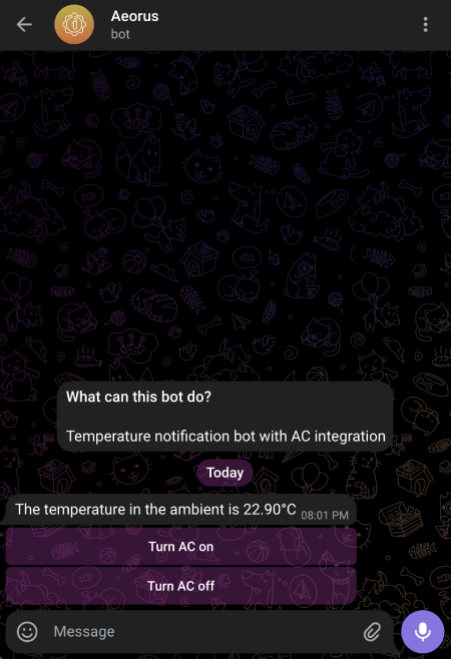

# Aeorus - Temperature control with Telegram

This is an university project (IoT), purely for learning purposes. The certificate comes from [UniversalTelegramBot](https://github.com/witnessmenow/Universal-Arduino-Telegram-Bot) library.

